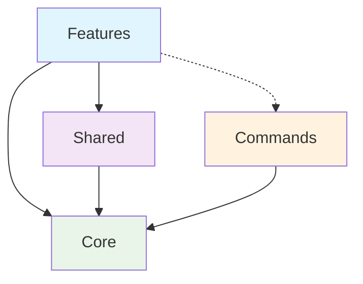
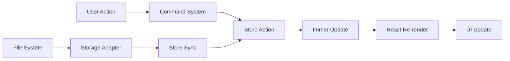
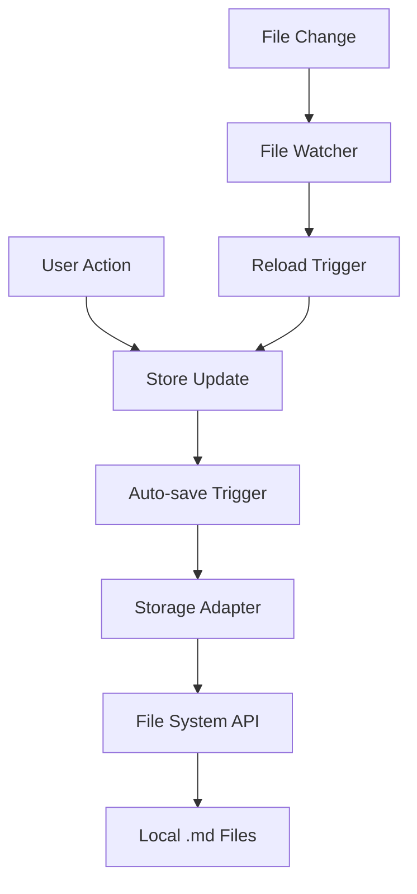
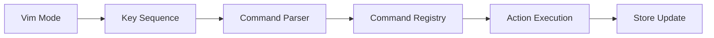

# 🏗️ Mindoodle Architecture Overview

<div align="center">

**Local-first Mind Mapping Application Architecture**

Built with React 18 + TypeScript 5.8 + Vite 6

</div>

---

## 📋 Table of Contents

- [🎯 Architecture Philosophy](#-architecture-philosophy)
- [🏢 Project Structure](#-project-structure)
- [🧩 Core Architecture Patterns](#-core-architecture-patterns)
- [🔄 Data Flow Architecture](#-data-flow-architecture)
- [🎨 UI Component Architecture](#-ui-component-architecture)
- [💾 Storage Architecture](#-storage-architecture)
- [⌨️ Command System](#%EF%B8%8F-command-system)
- [🔧 Development Patterns](#-development-patterns)
- [🚀 Build & Deployment](#-build--deployment)

---

## 🎯 Architecture Philosophy

Mindoodle follows a **Feature-Driven Architecture** with strict separation of concerns:

### Core Principles

- **🌱 Local-First**: All data processing happens locally, no external dependencies
- **📝 Markdown Native**: Markdown as the single source of truth for data persistence
- **🔀 Unidirectional Data Flow**: Predictable state management with Zustand + Immer
- **🧩 Modular Design**: Features are self-contained with clear boundaries
- **⚡ Performance First**: Optimized rendering with React 18 concurrent features

### Design Goals

- **Zero Network Dependencies**: Works completely offline
- **File System Integration**: Direct folder access via File System Access API
- **Vim-like Efficiency**: Modal interface for power users
- **Type Safety**: Strict TypeScript with comprehensive type checking

---

## 🏢 Project Structure

```
frontend/src/
├── 📱 App.tsx                    # Application entry point
├── 🎨 index.css                  # Global styles
├── 🚀 main.tsx                   # React root + providers
├── 🏗️ app/                       # Core application architecture
│   ├── 🧠 core/                  # Infrastructure layer
│   ├── ⚡ commands/              # Command system
│   ├── 🎯 features/              # Business logic features
│   ├── 🤝 shared/                # Cross-feature utilities
│   └── 📊 types/                 # Application types
└── 🔧 vite-env.d.ts             # Vite type definitions
```

### 🏗️ Core Architecture Layers

#### 1. **Infrastructure (`app/core/`)**
```
core/
├── 💾 storage/          # Storage abstraction layer
│   ├── adapters/        # Storage implementations
│   ├── types.ts         # Storage interfaces
│   └── StorageAdapterFactory.ts
├── 🗂️ data/            # Data management
├── 🌊 streams/          # Data streaming (reserved)
└── 📋 types/           # Core type definitions
```

#### 2. **Command System (`app/commands/`)**
```
commands/
├── 🧭 navigation/       # Navigation commands (h,j,k,l)
├── 🏗️ structure/       # Structure manipulation (dd, za)
├── ⚙️ system/          # System commands & parsers
├── 🎨 ui/              # UI commands
├── ✏️ editing/         # Text editing commands
└── 📱 application/     # App-level commands
```

#### 3. **Features (`app/features/`)**
```
features/
├── 🗺️ mindmap/         # Mind mapping core
│   ├── 🎛️ components/   # UI components
│   ├── 🎣 hooks/        # Feature hooks
│   ├── 🏪 store/        # Zustand store slices
│   ├── 🛠️ services/     # Business logic
│   ├── 🔧 utils/        # Domain utilities
│   ├── 📋 types/        # Feature types
│   └── 🎨 styles/       # Component styles
├── 🤖 ai/              # AI integration
├── 📝 markdown/        # Markdown processing
├── 📁 file-management/ # File operations
├── ⌨️ vim/             # Vim mode
└── 🎨 theme/           # Theme system
```

#### 4. **Shared Resources (`app/shared/`)**
```
shared/
├── 🎣 hooks/           # Reusable hooks
│   ├── ui/             # UI interaction hooks
│   ├── data/           # Data management hooks
│   ├── system/         # System-level hooks
│   └── network/        # Network hooks
├── 🔧 utils/           # Generic utilities
├── 🧩 components/      # Shared UI components
├── 📋 types/           # Common type definitions
├── 🎨 styles/          # Shared styles
└── 📊 constants/       # Application constants
```

---

## 🧩 Core Architecture Patterns

### 1. **Feature-Based Organization**

Each feature is completely self-contained:

```typescript
// Feature exports everything through index.ts
export * from './components';
export * from './hooks';
export * from './services';
export * from './store';
export * from './types';
```

### 2. **Dependency Rules**



- ✅ Features can import from `shared` and `core`
- ✅ Shared can import from `core`
- ❌ Core cannot import from features or shared
- ❌ Features cannot import from other features

### 3. **Path Aliases**

```typescript
// vite.config.js aliases
'@': './src'
'@shared': './src/app/shared'
'@core': './src/app/core'
'@mindmap': './src/app/features/mindmap'
'@ai': './src/app/features/ai'
'@markdown': './src/app/features/markdown'
// ... etc
```

---

## 🔄 Data Flow Architecture

### State Management Strategy



### 1. **Zustand + Immer Store**

```typescript
// Store structure with slices
const useMindMapStore = create<MindMapStore>()(
  devtools(
    subscribeWithSelector(
      immer((...args) => ({
        ...createDataSlice(...args),      // Mind map data
        ...createHistorySlice(...args),   // Undo/redo
        ...createUISlice(...args),        // UI state
        ...createNodeSlice(...args),      // Node operations
        ...createAISlice(...args),        // AI integration
        ...createSettingsSlice(...args),  // User settings
      }))
    )
  )
);
```

### 2. **Storage Abstraction**

```typescript
interface StorageAdapter {
  loadMap(path: string): Promise<MindMapData>;
  saveMap(path: string, data: MindMapData): Promise<void>;
  listMaps(): Promise<string[]>;
  deleteMap(path: string): Promise<void>;
}

// Factory pattern for different storage types
const adapter = createStorageAdapter('markdown-folder');
```

### 3. **Command-Driven Updates**

```typescript
// Commands translate user input to store actions
const commands = {
  'dd': () => store.getState().deleteSelectedNode(),
  'za': () => store.getState().toggleNodeFold(),
  'h': () => store.getState().navigateLeft(),
  // ...
};
```

---

## 🎨 UI Component Architecture

### Component Hierarchy

```
MindMapApp                    # Root application
├── MindMapProviders         # Context providers
├── MindMapWorkspace         # Main workspace
│   ├── MindMapCanvas       # SVG rendering area
│   │   ├── Node[]          # Individual nodes
│   │   ├── Connection[]    # Node connections
│   │   └── DragGuide       # Visual drag feedback
│   ├── PrimarySidebar      # Left sidebar
│   ├── ActivityBar         # Activity navigation
│   └── MindMapFooter       # Status bar
└── MindMapModals           # Modal dialogs
```

### 1. **Rendering Strategy**

- **SVG-based Canvas**: Scalable, precise positioning
- **React Concurrent**: Optimized updates with React 18
- **Virtualization**: Large mind maps render efficiently
- **Memoization**: Heavy use of `useMemo` and `useCallback`

### 2. **Event Handling Patterns**

```typescript
// Centralized event handling
const CanvasEventHandler = {
  handleNodeClick: (nodeId: string, event: MouseEvent) => {
    event.stopPropagation();
    store.getState().selectNode(nodeId);
  },

  handleCanvasClick: (event: MouseEvent) => {
    store.getState().clearSelection();
  },

  handleDragStart: (nodeId: string, event: DragEvent) => {
    store.getState().startDrag(nodeId, event);
  }
};
```

### 3. **Style Architecture**

- **CSS Modules**: Scoped component styles
- **Shared Theme System**: Consistent colors and spacing
- **Responsive Design**: Mobile-friendly layouts
- **CSS-in-JS**: Dynamic styles with `styled-components`

---

## 💾 Storage Architecture

### Local-First Strategy



### 1. **Storage Adapters**

```typescript
// Markdown Folder Adapter
class MarkdownFolderAdapter implements StorageAdapter {
  private folderHandle: FileSystemDirectoryHandle;

  async saveMap(path: string, data: MindMapData): Promise<void> {
    const markdown = exportToMarkdown(data);
    const fileHandle = await this.folderHandle.getFileHandle(
      `${path}.md`,
      { create: true }
    );
    // Write markdown to file
  }
}
```

### 2. **Data Serialization**

- **Input**: Mind map structure (JSON)
- **Storage**: Markdown format
- **Output**: Parsed back to JSON structure

```markdown
# Mind Map Title

## Main Topic 1
- Subtopic A
- Subtopic B

## Main Topic 2
- Subtopic C
  - Detail 1
  - Detail 2
```

### 3. **Workspace Management**

- **Multiple Folders**: Switch between project directories
- **Auto-detection**: Scan folders for `.md` files
- **Import/Export**: ZIP file support for backup/sharing

---

## ⌨️ Command System

### Modal Interface Architecture



### 1. **Command Categories**

```typescript
// Navigation commands
const navigationCommands = {
  'h': 'Navigate left',
  'j': 'Navigate down',
  'k': 'Navigate up',
  'l': 'Navigate right',
  'gg': 'Go to top',
  'G': 'Go to bottom'
};

// Structure commands
const structureCommands = {
  'dd': 'Delete node',
  'yy': 'Copy node',
  'p': 'Paste node',
  'za': 'Toggle fold',
  'zo': 'Open fold',
  'zc': 'Close fold'
};
```

### 2. **Sequence Parsing**

```typescript
interface CommandSequence {
  keys: string[];
  count?: number;
  motion?: string;
}

// Parse "3dd" -> { count: 3, command: 'dd' }
// Parse "dj" -> { command: 'd', motion: 'j' }
```

### 3. **Context-Aware Commands**

Commands behave differently based on application state:

- **Normal Mode**: Navigation and structure commands
- **Insert Mode**: Text editing in node editor
- **Visual Mode**: Multi-node selection (future)

---

## 🔧 Development Patterns

### 1. **Type Safety Strategy**

```typescript
// Strict TypeScript configuration
{
  "strict": true,
  "noUncheckedIndexedAccess": true,
  "exactOptionalPropertyTypes": true
}

// Comprehensive type coverage
interface MindMapNode {
  readonly id: string;
  readonly text: string;
  readonly position: Readonly<Position>;
  readonly children: readonly string[];
  readonly metadata: Readonly<NodeMetadata>;
}
```

### 2. **Error Handling Patterns**

```typescript
// Result pattern for error handling
type Result<T, E = Error> =
  | { success: true; data: T }
  | { success: false; error: E };

// Safe async operations
async function loadMindMap(path: string): Promise<Result<MindMapData>> {
  try {
    const data = await storageAdapter.loadMap(path);
    return { success: true, data };
  } catch (error) {
    return { success: false, error: error as Error };
  }
}
```

### 3. **Performance Optimization**

```typescript
// Memoized selectors
const useSelectedNode = () => useMindMapStore(
  useCallback(
    (state) => state.nodes.find(n => n.id === state.selectedNodeId),
    []
  )
);

// Debounced auto-save
const useDebouncedSave = () => {
  const saveData = useMindMapStore(state => state.saveData);
  return useMemo(
    () => debounce(saveData, 1000),
    [saveData]
  );
};
```

### 4. **Testing Strategy**

- **Unit Tests**: Individual utility functions
- **Integration Tests**: Feature workflows
- **E2E Tests**: User scenarios (planned)
- **Type Tests**: TypeScript compilation

---

## 🚀 Build & Deployment

### Development Environment

```bash
# Development server with HMR
npm run dev              # Start on port 5174

# Type checking
npm run type-check       # Standard TypeScript check
npm run type-check:strict # Strict mode validation

# Code quality
npm run lint             # ESLint + React rules
npm run lint:fix         # Auto-fix issues
```

### Production Build

```bash
# Production build pipeline
npm run build            # Type check + Vite build
npm run preview          # Preview production build
```

### Build Configuration

```typescript
// vite.config.js
export default defineConfig({
  build: {
    outDir: 'dist',
    sourcemap: true,        # Debug support
    target: 'esnext',       # Modern browsers
    rollupOptions: {
      output: {
        manualChunks: {     # Code splitting
          vendor: ['react', 'react-dom'],
          editor: ['@monaco-editor/react'],
          utils: ['zustand', 'immer']
        }
      }
    }
  }
});
```

### Deployment Strategy

- **Static Hosting**: GitHub Pages, Netlify, Vercel
- **No Backend Required**: Pure client-side application
- **Browser Support**: Modern browsers with File System Access API
- **Progressive Enhancement**: Graceful fallback for unsupported browsers

---

## 📚 Key Architecture Decisions

### 1. **Why Feature-Based Architecture?**

- **Scalability**: Easy to add new features without refactoring
- **Maintainability**: Clear ownership and boundaries
- **Team Development**: Multiple developers can work independently
- **Testing**: Features can be tested in isolation

### 2. **Why Zustand + Immer?**

- **Simplicity**: Less boilerplate than Redux
- **Performance**: Selective subscriptions prevent unnecessary re-renders
- **Immutability**: Immer provides safe state mutations
- **DevTools**: Excellent debugging experience

### 3. **Why Local-First?**

- **Privacy**: User data never leaves their device
- **Performance**: No network latency
- **Reliability**: Works offline
- **Control**: Users own their data

### 4. **Why Markdown as Storage?**

- **Portability**: Standard format, works everywhere
- **Version Control**: Git-friendly format
- **Human Readable**: Can be edited manually
- **Future-Proof**: Will always be readable

---

<div align="center">

**🎯 This architecture enables Mindoodle to be fast, reliable, and maintainable**

[⬆ Back to Top](#%EF%B8%8F-mindoodle-architecture-overview)

</div>
### Vim Mode Customization (Mindmap)

You can customize Vim keybindings for the mind map canvas and set a leader key via the Vim command line (press `:` in NORMAL mode):

- Set leader: `:set leader ,` or `:set leader <Space>`
- Add mapping: `:map <lhs> <command>` (e.g., `:map <leader>h left`)
- Remove mapping: `:unmap <lhs>`
- List mappings: `:maps`
- Clear all mappings: `:mapclear`

Notes:
- `<leader>` expands to your configured leader (default `,`). `<Space>` is supported.
- `<command>` is a command name (e.g., `left`, `down`, `cut`, `paste`, `center`, `add-child`, etc.). Mappings are applied before built-in Vim sequences.
